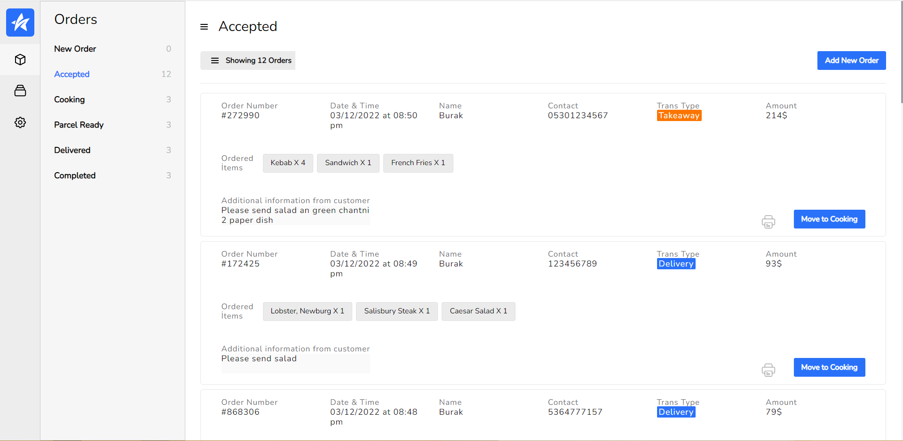
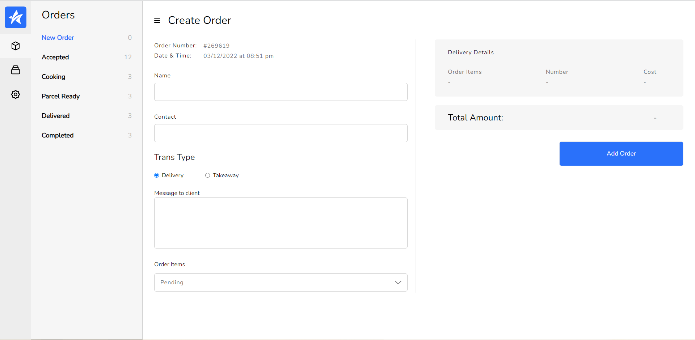
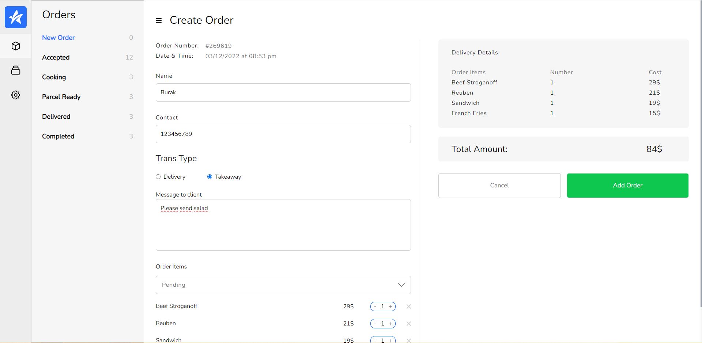
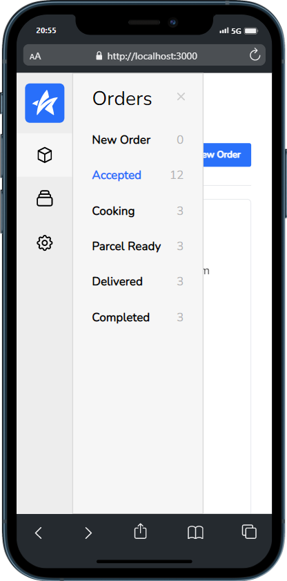
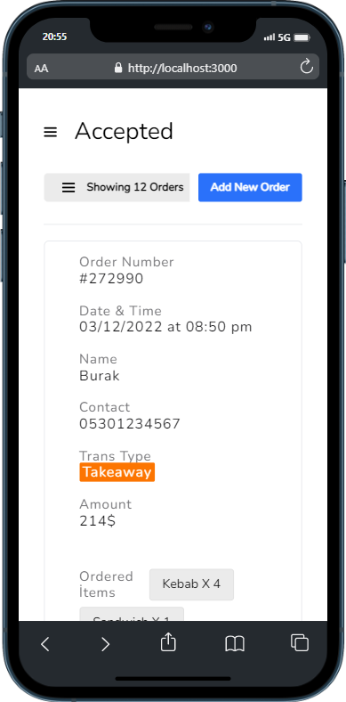
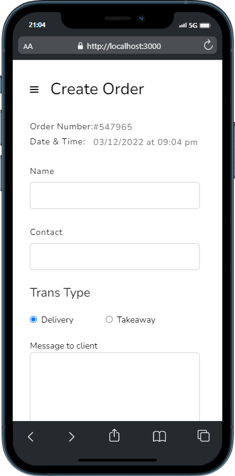
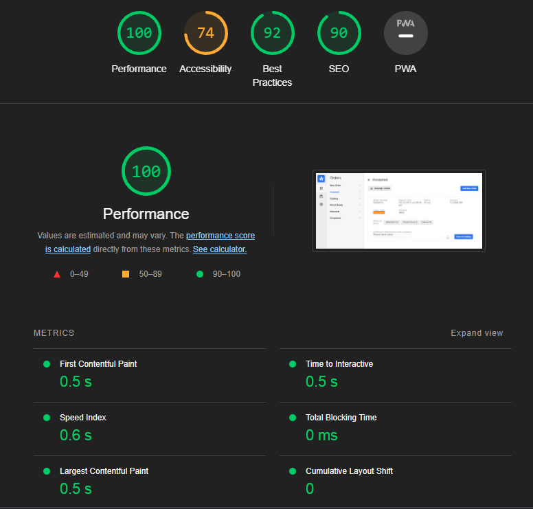
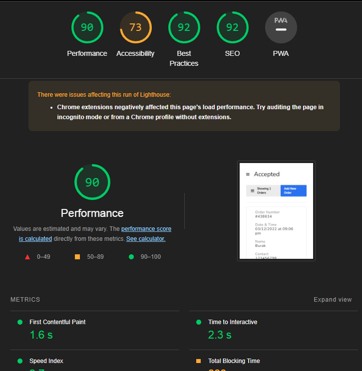

<div align='center'>
    <div>
        
    </div>
    <br/>
    <br/>
</div>

Recruitment project given by Go Art Metaverse Company

You can access the live demo from the link here: [ <b> Live Demo</b> ](https://brk-order-tracking.netlify.app/) 


## Content

- [About](#about)
- [Used Packages And Modules](#used-packages-and-modules)
- [Installation](#installation)
- [Previews](#previews)
- [App Performance](#app-performance)


<br>

# About
- The Order-Tracking Project is an order tracking application and offers its users an experience to create a new order and display the created order so that the most recent order is sorted first.


<br>


## Used Packages And Modules

- React JS
- React-redux
- Redux-Toolkit
- Js-cookie
- Eslint
- Tailwind
- Moment
- React-hook-form
- Prettier
- Netlify
- Cypress

<br>

## Installation

- First, clone the project:

```
git clone https://github.com/burak-caniklioglu/ikinci-el-project.git
```

- Then, start the project on localhost:

```
# install dependencies with npm
npm install
# or install dependencies with yarn
yarn install

# serve at localhost:3000
npm start or yarn start
```

```
# test
While your server is running, open another terminal and type
yarn run cypress open
'click' order-tracking-ChangePage.cy.js
```
# Previews

<center>

## Web - Main Page



<br>
<br>

## Web - Form Page Empty



<br>
<br>

## Web - Form Page Full



<br>
<br>

## Mobile

<p align="center">
    
    
    
</p>
</center>

# App Performance

## Web

<p align="center">

  
</p>

## Mobile

<p align="center">

  
</p>